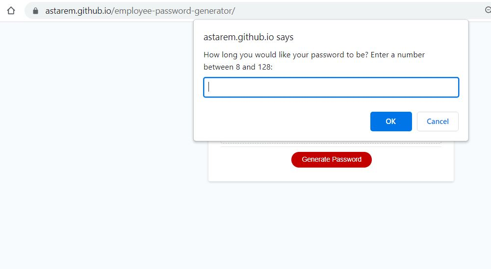
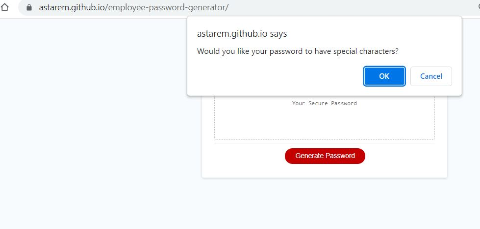
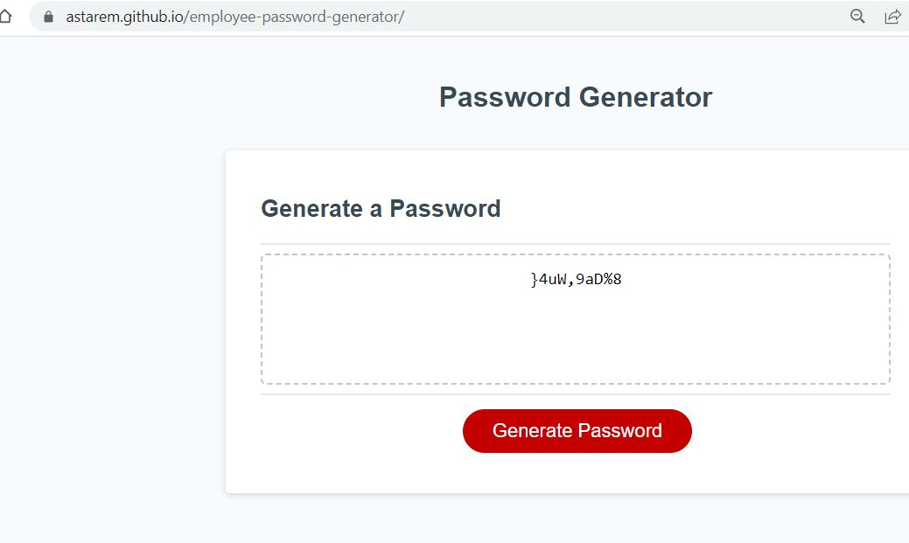
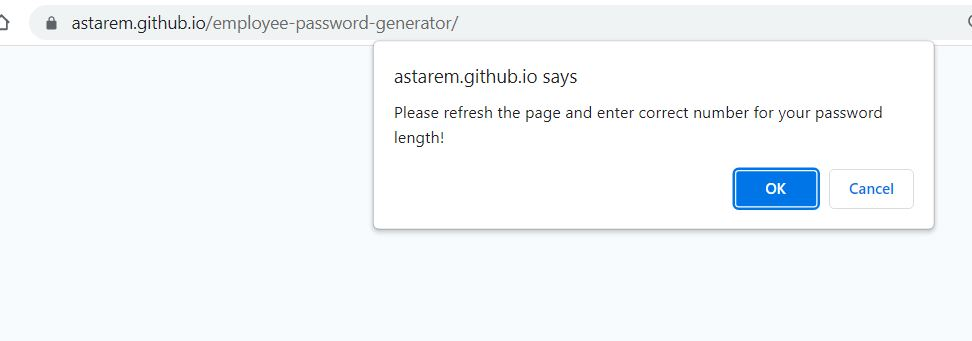
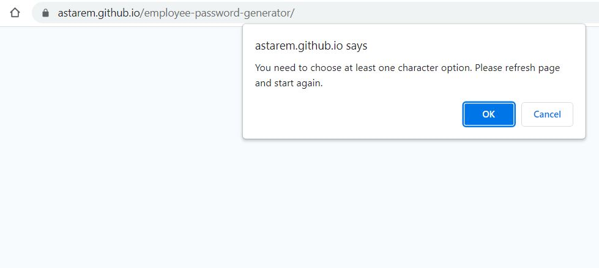

# Employee password generator

## Description

This web app generates random password for the user, employee in this case. 

Password might have special characters, numbers, lowercase, uppercase. User does not have to say yes to all the options, but they need to choose at least one.

User is asked to enter password length:

After that user have to answer 4 questions about their character choices (each of them displayed one by one in separate pop-up windows):

Once all questions answered, pop-up window disappears, user needs to press "Generate Password button, and his new password will be displayed:  

However if user chose wrong length for his password(less than 8 or more than 128 characters), they get a message they need to enter correct number:
, 

Also, if a user's answer about characters to all four questions is no, they get an error message, saying they need to choose at least one character option, refresh and start again :

I made this app to practice JavaScript:
- using functions
- accessing values
- making decisions 
- using loops
  
## Installation

No installation needed.
## Usage

Please view deployed app [here](https://astarem.github.io/employee-password-generator/).
